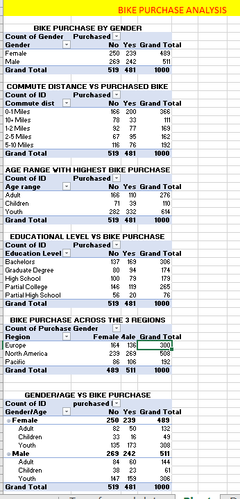
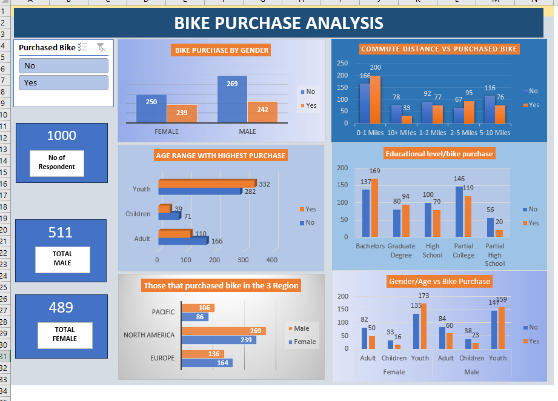

# Puchased_bike_Analysis

## **INTRODUCTION**
#### This project aims to analyze the various socioeconomic and demographic factors that affect bike purchasing behavior, using a dataset that includes detailed information on individuals' income, education, occupation, home and car ownership, commute distance, region, age, gender, marital status, and the number of children.
## **OBJECTIVES**
### The primary objectives of this project are:
- To identify key factors that influence the decision to purchase a bike.
- To analyze the relationship between income levels and bike purchasing behavior.
- To examine how education and occupation impact the likelihood of buying a bike.
- To explore the role of demographic variables such as age, gender, and marital status in bike purchase decisions.
- To investigate regional differences in bike purchasing patterns.
- To assess the influence of home and car ownership on the decision to buy a bike.
- To determine the impact of commute distance on bike purchase decisions.
## DATA SOURCE 
#### The data used for the analysis of bike sales was collected through a survey conducted using a Google Form. The survey gathered responses from a diverse group of participants, providing detailed information on various demographics and socio-economic factors. 
## DATA DESCRIPTION
The dataset contains information collected from a survey aimed at understanding factors influencing bike purchases. Each row in the dataset represents an individual respondent, and the columns capture various demographic and socio-economic attributes. Below is a detailed description of each column in the dataset:
1.	**ID:** A unique identifier for each respondent.
2.	**Marital Status:** Indicates the marital status of the respondent.
o	M: Married
o	S: Single
3. **Gender:** Indicates the gender of the respondent.
o	M: Male
o	F: Female
4.	**Income:** The annual income of the respondent in US dollars.
5.	**Children:** The number of children the respondent has.
6.	**Education:** The highest level of education attained by the respondent.
o	Bachelors
o	Partial College
o	High School
7.	**Occupation:** The type of occupation the respondent is engaged in.
o	Skilled Manual
o	Clerical
o	Professional
o	Management
o	Manual
8.	**Home Owner:** Indicates whether the respondent owns a home.
o	Yes: Owns a home
o	No: Does not own a home
9.	**Cars:** The number of cars owned by the respondent.
10.	**Commute Distance:** The distance the respondent commutes to work.
o	0-1 Miles
o	1-2 Miles
o	2-5 Miles
o	5-10 Miles
11.	**Region:** The region where the respondent resides.
o	Europe
o	Pacific
o	North America
12.	**Age:** The age of the respondent.
13.	**Purchased Bike:** Indicates whether the respondent purchased a bike.
o	Yes: Purchased a bike
o	No: Did not purchase a bike
## DATA COLLECTION/PREPARATION

## TOOLS USED
#### For the "Analysis of Bike Sales" project, the following tools will be utilized:
#### Excel for Data Cleansing and Transformation
Excel will be used as the primary tool for data cleansing and transformation. This involves:
- **Data Import:** Importing the raw data from the survey into Excel.
- **Data Cleaning:** Identifying and correcting any inaccuracies or inconsistencies in the data. This includes handling missing values, removing duplicates, and ensuring uniform formatting.
- **Data Transformation:** Structuring the data for analysis. This includes creating new calculated columns, such as categorizing income ranges, calculating age groups, and summarizing key metrics.
- **Data Validation:** Ensuring that the data is accurate and reliable through validation techniques and checks.
#### Excel Pivot for Analysis and Visualization
Excel Pivot table and chart will be used to perform the analysis and create visualizations for the dataset. This involves:

## DATA CLEANSING AND TRANSFORMATION
#### Data Cleansing Steps:
#### Marital Status:
- Standardization: Ensured that marital statuses were consistently labeled and changed as either M to "Married" or S to "Single".
#### Gender:
- Standardization: Ensured that gender entries were consistently changed as  M for "Male" and F for "Female".
- Correction of Inconsistencies: Corrected any inconsistent entries or misspellings in the gender column.
#### Age:
- Categorization: Added an "Age Range" column to categorize respondents into “Children” (under 31), "Youth" (under 50) and "Adult" (50 and over) using the IF function.
#### Duplicates:
- Identification: Checked for duplicate entries based on the unique identifier (ID) and other relevant attributes.
- Removal: Removed any duplicate entries to ensure each respondent was only represented once in the dataset.
#### Error Checking:
- Validation of Data Entries: Ensured that all numerical fields (e.g., Income, Children, Cars) contained valid numerical values.
- Correction of Errors: Addressed any errors found in the data entries, such as incorrect income formats or invalid ages.
#### Data Transformation Steps:
#### 1.	Age Range Calculation:
- **Children:** Defined as respondents aged below 31
- **Youth:** Defined as respondents aged below 50.
- **Adult:** Defined as respondents aged 50 and above.
- **Implementation:** Created a new column "Age Range" to reflect these categories.
Using the IF nested function as below:
=IF(L2<=31, "Children", IF(L2<=50, "Youth", IF(L2<=70, "Adult" )))
## TRANSFORMED DATA

## ANALYSIS AND SUMMARISES WITH PIVOT TABLE

## VISUALIZATION/DASHBOARD

The "Bike Purchase Analysis" dashboard provides a comprehensive overview of the factors influencing bike purchases, visualized through various charts and metrics. Here’s a breakdown of the insights drawn from the dashboard:

#### **Total Metrics:**
- Total Respondents: 1000
- Purchased a Bike: 511
- Did Not Purchase a Bike: 489

#### **1. Bike Purchase by Gender**
#### Females:
- Purchased: 239
- Did Not Purchase: 250
#### Males:
- Purchased: 269
- Did Not Purchase: 242
#### Insight: Males have a slightly higher bike purchase rate compared to females.
#### **2. Commute Distance vs Purchased Bike:**
#### 0-1 Miles:
- Purchased: 200
- Did Not Purchase: 166
#### 10+ Miles:
- Purchased: 78
- Did Not Purchase: 33
  #### 1-2 Miles:
- Purchased: 92
- Did Not Purchase: 77
#### 2-5 Miles:
- Purchased: 67
- Did Not Purchase: 95
#### 5-10 Miles:
- Purchased: 116
- Did Not Purchase: 76
#### Insight: Most bike purchases are made by individuals with a short commute distance (0-1 Miles).
#### **3. Age Range with Highest Purchase**
#### Youth:
- Purchased: 332
- Did Not Purchase: 282
#### Children:
- Purchased: 39
- Did Not Purchase: 71
#### Adult:
- Purchased: 110
- Did Not Purchase: 166
#### Insight: Youth are the highest purchasers of bikes, followed by adults.
#### **4. Educational Level/Bike Purchase**
#### Bachelors:
- Purchased: 169
- Did Not Purchase: 137
#### Graduate Degree:
- Purchased: 94
- Did Not Purchase: 80
#### High School:
- Purchased: 100
- Did Not Purchase: 79
#### Partial College:
- Purchased: 146
- Did Not Purchase: 119
#### Partial High School:
- Purchased: 56
- Did Not Purchase: 20
  #### Insight: Individuals with a Bachelor’s degree have the highest bike purchase rate, followed by those with partial college education.
#### **5. Those that Purchased a Bike in the 3 Regions**
#### Pacific:
- Males: 106
- Females: 86
#### North America:
- Males: 269
- Females: 239
#### Europe:
- Males: 136
- Females: 164
#### Insight: North America has the highest bike purchase rate, with males leading in purchases in the Pacific and North America regions, while females lead in Europe.
#### **6. Gender/Age vs Bike Purchase**
#### Adult Females:
- Purchased: 82
- Did Not Purchase: 50
#### Children Females:
- Purchased: 33
- Did Not Purchase: 39
#### Youth Females:
- Purchased: 135
- Did Not Purchase: 173
#### Adult Males:
- Purchased: 84
- Did Not Purchase: 60
#### Children Males:
- Purchased: 38
- Did Not Purchase: 33
#### Youth Males:
- Purchased: 145
- Did Not Purchase: 159
#### Insight: Youth, both male and female, are the largest group purchasing bikes, with a notable difference in purchase rates among adults and children.

## RESULT/FINDINGS
Based on the analysis conducted using the cleaned and transformed dataset, the following key insights and patterns have been identified regarding the factors influencing the decision to purchase a bike among the surveyed individuals:
1.	**Income Influence:**
- **Individuals with higher incomes** (e.g., $160,000.00) are more likely to purchase a bike compared to those with lower incomes.
- **Respondents with moderate to high incomes** (e.g., $70,000.00 and above) showed a higher likelihood of purchasing a bike.
2.	**Demographic Factors:**
- **Gender:** Males are slightly more likely to purchase bikes compared to females in the dataset.
- **Age:** Younger individuals (classified as "Youth", aged below 50) are more likely to purchase bikes. For instance, individuals aged 33 and 41 who fall into the "Youth" category tend to purchase bikes more than those in the "Adult" category (aged 50 and above).
3.	**Socio-economic Factors:**
- **Education:** Individuals with a high school education or partial college education seem to purchase bikes more frequently than those with bachelor’s degrees.
- **Occupation:** Occupations also play a role, with professionals and management-level individuals being more likely to purchase bikes compared to those in clerical or manual jobs.
- **Home Ownership:** Homeowners are more likely to purchase bikes compared to non-homeowners. This could be linked to higher disposable income among homeowners.
4.	**Commute and Regional Influence:**
- **Commute Distance:** Shorter commute distances (0-1 Miles) are associated with a higher likelihood of bike purchases. This suggests that individuals who live closer to their workplace find it more feasible to commute by bike.
- **Region:** Individuals residing in the Pacific region are more likely to purchase bikes compared to those in Europe. This regional difference may be influenced by factors such as urban infrastructure and cultural attitudes toward biking.
5.	**Family Considerations:**
- **Number of Children:** Individuals with fewer children (e.g., 0 or 1) tend to purchase bikes more frequently. This could be due to the convenience and feasibility of biking for those with smaller families.
- **Cars Owned:** Owning fewer cars (e.g., 0 or 1) correlates with a higher likelihood of bike purchases. This suggests that individuals who rely less on cars are more inclined to consider biking as an alternative mode of transportation.
## Conclusion
The analysis reveals that higher income, younger age, shorter commute distances, residence in the Pacific region, and specific socio-economic factors such as education and occupation significantly influence the likelihood of bike purchases. These findings can help stakeholders tailor their strategies to target the identified demographic groups more effectively and promote bike usage as a sustainable mode of transportation.
