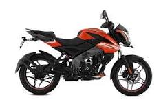
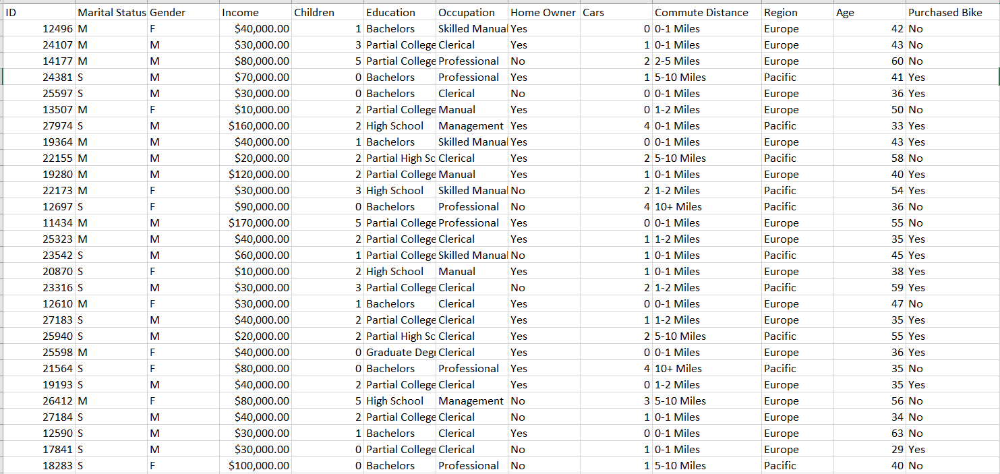
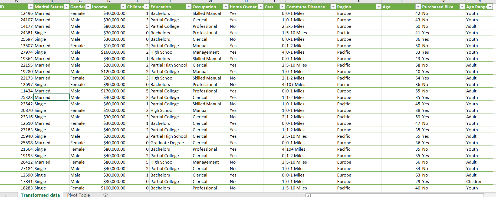

# Puchased_bike_Analysis

## **INTRODUCTION**
#### This project aims to analyze the various socioeconomic and demographic factors that affect bike purchasing behavior, using a dataset that includes detailed information on individuals' income, education, occupation, home and car ownership, commute distance, region, age, gender, marital status, and the number of children.
## **OBJECTIVES**
### The primary objectives of this project are:
- To identify key factors that influence the decision to purchase a bike.
- To analyze the relationship between income levels and bike purchasing behavior.
- To examine how education and occupation impact the likelihood of buying a bike.
- To explore the role of demographic variables such as age, gender, and marital status in bike purchase decisions.
- To investigate regional differences in bike purchasing patterns.
- To assess the influence of home and car ownership on the decision to buy a bike.
- To determine the impact of commute distance on bike purchase decisions.
## DATA SOURCE 
#### The data used for the analysis of bike sales was collected through a survey conducted using a Google Form. The survey gathered responses from a diverse group of participants, providing detailed information on various demographics and socio-economic factors. 
## DATA DESCRIPTION
The dataset contains information collected from a survey aimed at understanding factors influencing bike purchases. Each row in the dataset represents an individual respondent, and the columns capture various demographic and socio-economic attributes. Below is a detailed description of each column in the dataset:
1.	**ID:** A unique identifier for each respondent.
2.	**Marital Status:** Indicates the marital status of the respondent.
o	M: Married
o	S: Single
3. **Gender:** Indicates the gender of the respondent.
o	M: Male
o	F: Female
4.	**Income:** The annual income of the respondent in US dollars.
5.	**Children:** The number of children the respondent has.
6.	**Education:** The highest level of education attained by the respondent.
o	Bachelors
o	Partial College
o	High School
7.	**Occupation:** The type of occupation the respondent is engaged in.
o	Skilled Manual
o	Clerical
o	Professional
o	Management
o	Manual
8.	**Home Owner:** Indicates whether the respondent owns a home.
o	Yes: Owns a home
o	No: Does not own a home
9.	**Cars:** The number of cars owned by the respondent.
10.	**Commute Distance:** The distance the respondent commutes to work.
o	0-1 Miles
o	1-2 Miles
o	2-5 Miles
o	5-10 Miles
11.	**Region:** The region where the respondent resides.
o	Europe
o	Pacific
o	North America
12.	**Age:** The age of the respondent.
13.	**Purchased Bike:** Indicates whether the respondent purchased a bike.
o	Yes: Purchased a bike
o	No: Did not purchase a bike
## DATA COLLECTION/PREPARATION

## TOOLS USED
#### For the "Analysis of Bike Sales" project, the following tools will be utilized:
#### Excel for Data Cleansing and Transformation
Excel will be used as the primary tool for data cleansing and transformation. This involves:
- **Data Import:** Importing the raw data from the survey into Excel.
- **Data Cleaning:** Identifying and correcting any inaccuracies or inconsistencies in the data. This includes handling missing values, removing duplicates, and ensuring uniform formatting.
- **Data Transformation:** Structuring the data for analysis. This includes creating new calculated columns, such as categorizing income ranges, calculating age groups, and summarizing key metrics.
- **Data Validation:** Ensuring that the data is accurate and reliable through validation techniques and checks.
#### Power BI for Analysis and Visualization
Power BI will be used to perform the analysis and create visualizations for the dataset. This involves:
- **Data Import:** Importing the cleansed and transformed data from Excel into Power BI.
- **Analysis:** Using Power BI's analytical tools to uncover insights, identify trends, and perform statistical analysis. This includes creating measures, calculated columns, and utilizing DAX functions for advanced calculations.
- **Visualization:** Designing interactive and dynamic visualizations such as charts, graphs, and dashboards to present the findings. This includes visualizations to depict the relationship between bike purchases and various factors like income, age, occupation, and region.
- **Reporting:** Generating comprehensive reports that summarize the key insights and findings from the analysis. These reports can be shared and accessed interactively by stakeholders.
## DATA CLEANSING AND TRANSFORMATION
#### Data Cleansing Steps:
#### Marital Status:
- Standardization: Ensured that marital statuses were consistently labeled and changed as either M to "Married" or S to "Single".
#### Gender:
- Standardization: Ensured that gender entries were consistently changed as  M for "Male" and F for "Female".
- Correction of Inconsistencies: Corrected any inconsistent entries or misspellings in the gender column.
#### Age:
- Categorization: Added an "Age Range" column to categorize respondents into “Children” (under 31), "Youth" (under 50) and "Adult" (50 and over) using the IF function.
#### Duplicates:
- Identification: Checked for duplicate entries based on the unique identifier (ID) and other relevant attributes.
- Removal: Removed any duplicate entries to ensure each respondent was only represented once in the dataset.
#### Error Checking:
- Validation of Data Entries: Ensured that all numerical fields (e.g., Income, Children, Cars) contained valid numerical values.
- Correction of Errors: Addressed any errors found in the data entries, such as incorrect income formats or invalid ages.
#### Data Transformation Steps:
#### 1.	Age Range Calculation:
- **Children:** Defined as respondents aged below 31
- **Youth:** Defined as respondents aged below 50.
- **Adult:** Defined as respondents aged 50 and above.
- **Implementation:** Created a new column "Age Range" to reflect these categories.
Using the IF nested function as below:
=IF(L2<=31, "Children", IF(L2<=50, "Youth", IF(L2<=70, "Adult" )))
## TRANSFORMED DATA

